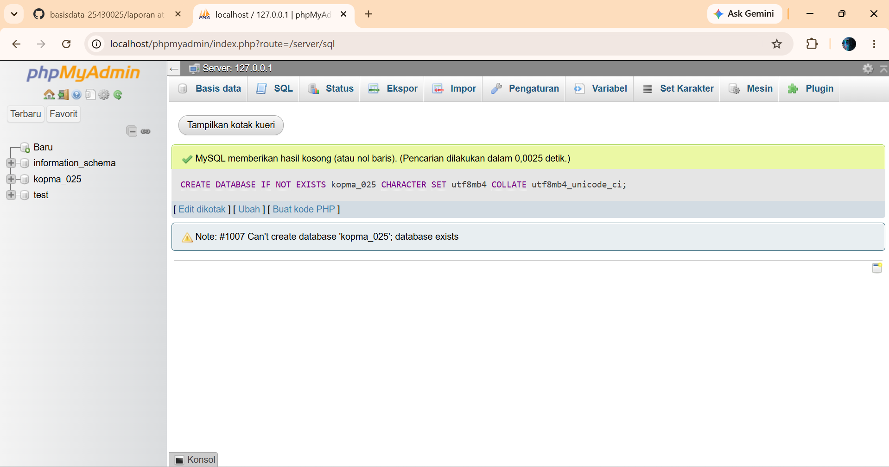
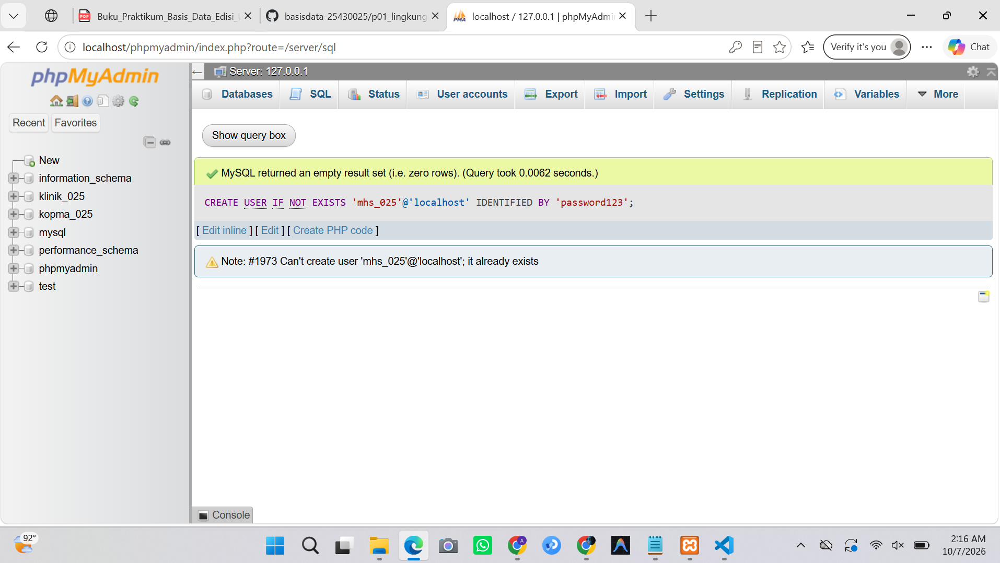
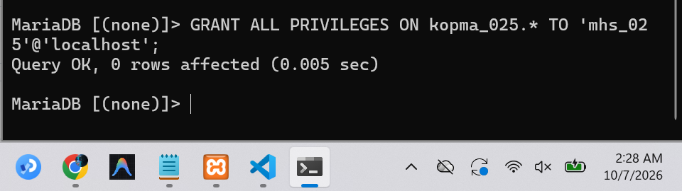
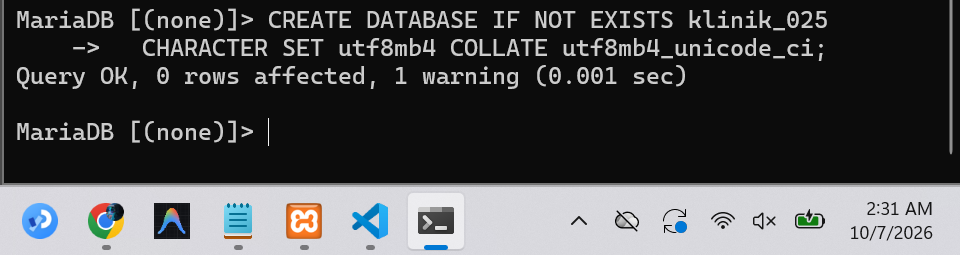
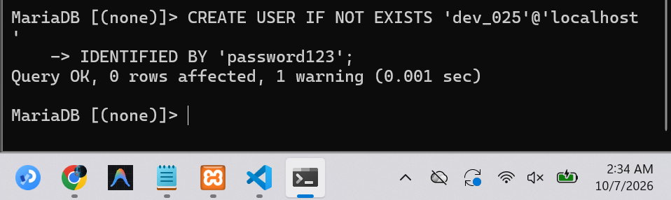
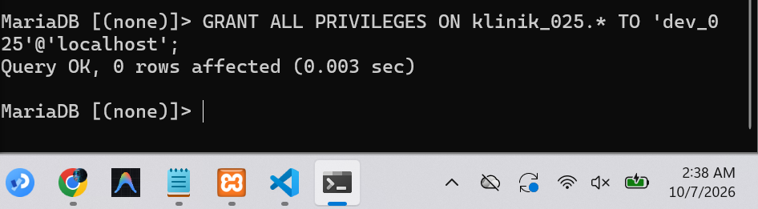

# Laporan Praktikum Basis Data - Pertemuan 1

**Nama:** Mutiara Icha Yani
**NIM:** 25430025
**Kelas:** A
**Tanggal:** 6 Oktober 2026

## 1. Tujuan Praktikum

Praktikum Modul 1 bertujuan untuk memahami dan menyiapkan lingkungan kerja basis data menggunakan MariaDB. Pada praktikum ini dilakukan pembuatan database, pembuatan user, dan pemberian hak akses kepada user.

Selain itu, praktikum ini juga bertujuan untuk menyiapkan database yang akan digunakan dalam proyek Klinik serta memahami pentingnya menjaga keamanan password ketika menyimpan file pada GitHub.

## 2. Ringkasan Dasar Teori

Database merupakan kumpulan data yang disimpan secara terstruktur sehingga dapat dikelola dan digunakan sesuai kebutuhan. MariaDB menyediakan perintah SQL untuk membuat dan mengelola database.

Perintah yang digunakan dalam praktikum ini antara lain `CREATE DATABASE` untuk membuat database, `CREATE USER` untuk membuat user, dan `GRANT` untuk memberikan hak akses kepada user.

Pada praktikum ini digunakan `utf8mb4` sebagai character set dan `utf8mb4_unicode_ci` sebagai collation. Selain itu, `IF NOT EXISTS` digunakan agar database atau user tidak dibuat kembali apabila sudah tersedia.

## 3. Hasil Langkah Percobaan

### 3.1 Membuat Database `kopma_025`

Perintah yang digunakan:

```sql
CREATE DATABASE IF NOT EXISTS kopma_025
  CHARACTER SET utf8mb4 COLLATE utf8mb4_unicode_ci;
```

**Hasil Percobaan:**



**Keterangan:**
Database `kopma_025` berhasil dibuat menggunakan MariaDB.

---

### 3.2 Membuat User `mhs_025`

Perintah yang digunakan:

```sql
CREATE USER IF NOT EXISTS 'mhs_025'@'localhost'
  IDENTIFIED BY '<password_kerja>';
```

**Hasil Percobaan:**



**Keterangan:**
User `mhs_025` berhasil dibuat dengan host `localhost`. Password asli tidak dicantumkan dalam file yang akan diunggah ke GitHub.

---

### 3.3 Memberikan Hak Akses kepada `mhs_025`

Perintah yang digunakan:

```sql
GRANT ALL PRIVILEGES ON kopma_025.* TO 'mhs_025'@'localhost';
```

**Hasil Percobaan:**



**Keterangan:**
User `mhs_025` berhasil diberikan seluruh hak akses terhadap database `kopma_025`.

---

### 3.4 Membuat Database `klinik_025`

Perintah yang digunakan:

```sql
CREATE DATABASE IF NOT EXISTS klinik_025
  CHARACTER SET utf8mb4 COLLATE utf8mb4_unicode_ci;
```

**Hasil Percobaan:**



**Keterangan:**
Database `klinik_025` berhasil dibuat dan digunakan sebagai database untuk Milestone Proyek 1.

---

### 3.5 Membuat User `dev_025`

Perintah yang digunakan:

```sql
CREATE USER IF NOT EXISTS 'dev_025'@'localhost'
  IDENTIFIED BY '<password_pengembangan>';
```

**Hasil Percobaan:**



**Keterangan:**
User `dev_025` berhasil dibuat untuk kebutuhan pengembangan database Klinik.

---

### 3.6 Memberikan Hak Akses kepada `dev_025`

Perintah yang digunakan:

```sql
GRANT ALL PRIVILEGES ON klinik_025.* TO 'dev_025'@'localhost';
```

**Hasil Percobaan:**



**Keterangan:**
User `dev_025` berhasil diberikan seluruh hak akses terhadap database `klinik_025`.

## 4. Jawaban Titik Analisis

### 1. Apa fungsi `IF NOT EXISTS`?

`IF NOT EXISTS` digunakan agar database atau user hanya dibuat apabila belum tersedia. Jika sudah ada, perintah tidak membuat objek yang sama kembali.

### 2. Mengapa password asli tidak ditulis dalam file GitHub?

Password tidak ditulis secara langsung untuk menjaga keamanan. Jika password dimasukkan ke repository GitHub, orang lain yang dapat mengakses repository berpotensi mengetahui password tersebut.

### 3. Apa fungsi `GRANT ALL PRIVILEGES`?

`GRANT ALL PRIVILEGES` digunakan untuk memberikan seluruh hak akses kepada user terhadap database yang ditentukan.

### 4. Apa fungsi `localhost`?

`localhost` menunjukkan bahwa user digunakan untuk koneksi dari komputer lokal tempat MariaDB dijalankan.

## 5. Hasil Latihan dan Modifikasi

Pada latihan ini nama database dan user disesuaikan dengan identitas mahasiswa dan kebutuhan proyek.

Database latihan:

```text
kopma_025
```

User latihan:

```text
mhs_025
```

Database proyek:

```text
klinik_025
```

User pengembangan:

```text
dev_025
```

Skrip yang digunakan:

```sql
CREATE DATABASE IF NOT EXISTS kopma_025
  CHARACTER SET utf8mb4 COLLATE utf8mb4_unicode_ci;

CREATE USER IF NOT EXISTS 'mhs_025'@'localhost'
  IDENTIFIED BY '<password_kerja>';

GRANT ALL PRIVILEGES ON kopma_025.* TO 'mhs_025'@'localhost';

CREATE DATABASE IF NOT EXISTS klinik_025
  CHARACTER SET utf8mb4 COLLATE utf8mb4_unicode_ci;

CREATE USER IF NOT EXISTS 'dev_025'@'localhost'
  IDENTIFIED BY '<password_pengembangan>';

GRANT ALL PRIVILEGES ON klinik_025.* TO 'dev_025'@'localhost';
```

## 6. Tugas Mandiri: Milestone Proyek 1

Milestone Proyek 1 adalah menyiapkan database untuk proyek Klinik.

Database yang dibuat:

```text
klinik_025
```

User pengembangan:

```text
dev_025
```

User tersebut diberikan hak akses penuh menggunakan:

```sql
GRANT ALL PRIVILEGES ON klinik_025.* TO 'dev_025'@'localhost';
```

Database ini nantinya digunakan untuk pembuatan tabel dan pengelolaan data pada proyek Klinik di modul berikutnya.

## 7. Pembahasan dan Kendala

Pada praktikum ini dilakukan proses pembuatan database, user, dan pemberian hak akses. Database dan user dibuat sesuai dengan kebutuhan latihan serta proyek Klinik.

Kendala yang dapat terjadi adalah database atau user sudah tersedia ketika perintah dijalankan kembali. Penggunaan `IF NOT EXISTS` membantu agar proses tidak menghasilkan error karena objek tersebut sudah ada.

Selain itu, password harus dijaga agar tidak ikut tersimpan di repository GitHub. Oleh karena itu, pada file yang diunggah digunakan placeholder sebagai pengganti password asli.

## 8. Kesimpulan

Praktikum Modul 1 berhasil menyiapkan lingkungan kerja basis data menggunakan MariaDB. Database `kopma_025` dan `klinik_025` berhasil dibuat, begitu juga dengan user `mhs_025` dan `dev_025`.

Hak akses terhadap masing-masing database diberikan menggunakan perintah `GRANT ALL PRIVILEGES`. Praktikum ini juga memberikan pemahaman mengenai pentingnya keamanan password ketika menggunakan GitHub sebagai tempat penyimpanan hasil praktikum.

## 9. Pernyataan Penggunaan AI

AI digunakan sebagai alat bantu untuk memahami fungsi perintah SQL, membantu menyusun struktur laporan, dan merapikan penulisan. Proses praktikum, eksekusi perintah, dan hasil screenshot dilakukan berdasarkan pekerjaan yang dikerjakan sendiri.

## 10. Bukti Git

**Tautan repositori:**
`https://github.com/mutiaraichayani-dotcom/basisdata-25430025`

**Hash commit:**
`226f906`

**File yang diunggah:**
`p01_lingkungan_25430025.sql`

## Checklist

* [✓] Menyiapkan lingkungan database.
* [✓] Membuat database `kopma_025`.
* [✓] Membuat user `mhs_025`.
* [✓] Memberikan hak akses kepada `mhs_025`.
* [✓] Membuat database `klinik_025`.
* [✓] Membuat user `dev_025`.
* [✓] Memberikan hak akses kepada `dev_025`.
* [✓] Tidak mencantumkan password asli.
* [✓] Menyimpan hasil praktikum di GitHub.
* [✓] Mencantumkan tautan repository.
* [✓] Mencantumkan hash commit.
* [✓] Menyelesaikan Milestone Proyek 1.
